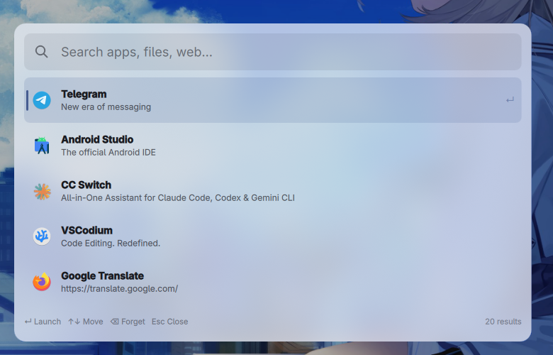
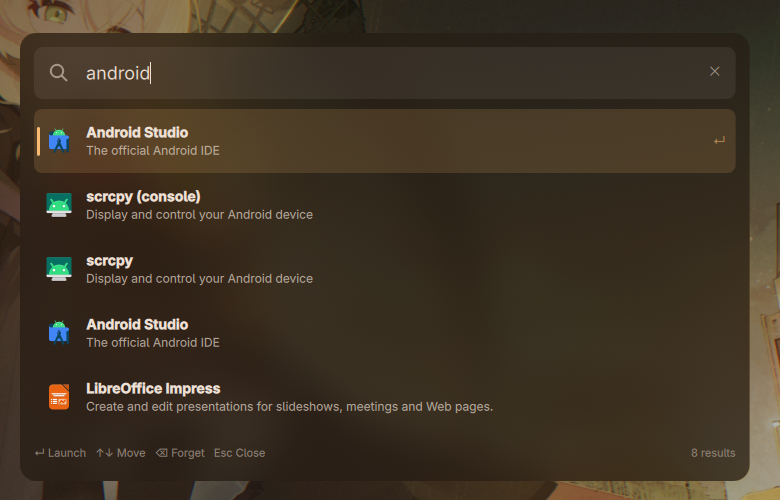

<div align="center">

# QsFlow (QuickShell)

<br>

中文 | [English](../README.md)

</div>

## 概述

QsFlow 是一款 Wayland 原生的 Linux 应用启动器和快速搜索工具。在悬浮窗口中输入关键词，即可搜索已安装应用、Firefox 书签、网页建议、GitHub 以及进行即时数学计算。后端基于 Rust 异步实现，前端使用 [Quickshell](https://github.com/outfoxxed/quickshell) 的 QML 构建。

## 截图

| 亮色主题 — 高频使用项 | 暗色主题 — 模糊应用搜索（`android`） |
|------------------------|-------------------------------------|
|  |  |

## 功能特性

- **模糊应用启动器** — 搜索 XDG 数据目录中的 `.desktop` 条目。
- **文件与路径搜索** — 遍历 `~/Desktop`、`~/Documents`、`~/Downloads` 与主目录，直接打开结果。
- **剪贴板历史** — 通过 `c` 前缀搜索并粘贴 `cliphist` 记录。
- **系统命令** — `lock`、`reboot`、`shutdown`、`suspend`、`logout`。
- **命令运行** — 通过 `r` 前缀模糊搜索 `$PATH` 可执行文件并运行（可带参数）。
- **窗口切换** — 通过 `w` 前缀切换到任一打开的 niri 窗口。
- **Firefox 书签与历史** — 直接读取 `places.sqlite`。
- **网页与 GitHub** — Google 搜索建议（`s`）与 GitHub 链接（`g`）。
- **内联工具** — 即时计算；有道翻译（`tr`，回车复制）。
- **使用历史** — 留空时展示高频项，按 `Delete` 删除。
- **GTK 主题集成** — 从 GTK4 主题 CSS 读取主题色。
- **插件系统** — TOML 注册表，可启用、禁用、调整顺序或修改前缀。
- **图标解析** — Papirus、Breeze、Adwaita、hicolor 及 Flatpak；会话内缓存。

## 环境要求

- 支持 `wlr-layer-shell` 协议的 **Wayland** 混成器
- **[Quickshell](https://github.com/outfoxxed/quickshell)**
- Rust 工具链（用于编译后端）
- Firefox（可选，用于书签和历史搜索）
- [cliphist](https://github.com/sentriz/cliphist)（可选，用于剪贴板历史）

## 快速开始

```bash
git clone https://github.com/Prslc/QsFlow.git
cd QsFlow/core
cargo build --release
ln -s "$(pwd)/target/release/qsflow-core" ~/.local/bin/qsflow-core
```

然后在混成器配置中绑定快捷键（如 `Alt+Space`）来启动：

```bash
quickshell -p /path/to/QsFlow/ui/MainShell.qml
```

启动器以全屏覆盖方式打开，带调暗背景与居中卡片。默认的按热键拉起流程下，
`Esc`/点击卡片外会退出；常驻模式（见下）下热键切换窗口，关闭改为隐藏。

## 常驻模式（可选 —— 零冷启动）

默认每次按热键都会重新拉起 QML 壳与 Rust 内核，首次按键需付 ~300ms 冷启动
（主要是 QML/Qt 初始化，不是核心）。要让启动器即刻弹出，让一个常驻的壳+内核
保持存活，通过 Quickshell 的 IPC 切换窗口：

```ini
# ~/.config/systemd/user/qsflow-launcher.service
[Unit]
Description=QsFlow launcher (resident quickshell + core)
After=graphical-session.target
PartOf=graphical-session.target

[Service]
Type=simple
ExecStart=/usr/bin/quickshell -p /abs/path/to/QsFlow/ui/MainShell.qml
Restart=on-failure
RestartSec=2
# qsflow-core 从 PATH 拉起；加入其所在目录
Environment=PATH=/home/you/.local/bin:/usr/local/bin:/usr/bin:/bin
# Wayland + Qt 客户端在 user service 下需要会话环境
Environment=WAYLAND_DISPLAY=wayland-1
Environment=XDG_RUNTIME_DIR=/run/user/1000
# 常驻模式：隐藏启动，用 `ipc call launcher toggle` 切换
Environment=QSFLOW_RESIDENT=1

[Install]
WantedBy=default.target
```

```sh
systemctl --user enable --now qsflow-launcher
# niri 热键 —— 切换而非重新拉起：
#   Alt+Space { spawn-sh "quickshell ipc --path $HOME/Project/QsFlow/ui/MainShell.qml call launcher toggle"; }
```

`MainShell.qml` 暴露了一个 `IpcHandler`（`target: "launcher"`），带
`open` / `close` / `toggle`。`QSFLOW_RESIDENT=1` 选中常驻模式（隐藏启动、关闭即隐藏）；
不带该变量时，直接 `quickshell -p ui/MainShell.qml` 保持旧行为——启动即弹出、关闭即退出，
因此手动/开发路径与 systemd 服务相互独立。恢复：`systemctl --user disable --now
qsflow-launcher` 并还原绑定的启动方式。


## 使用说明

| 输入 | 操作 |
|------|------|
| `firefox` | 模糊搜索已安装应用 |
| `b <关键词>` | 搜索 Firefox 书签 |
| `h <关键词>` | 搜索 Firefox 历史 |
| `f <关键词>` | 按文件名搜索 |
| `d <关键词>` | 按路径搜索（多词模糊） |
| `r <关键词>` | 模糊搜索 `$PATH` 可执行文件并运行 |
| `w <关键词>` | 切换到匹配的打开窗口 |
| `c <关键词>` | 搜索剪贴板历史 |
| `s <关键词>` | Google 搜索建议 |
| `g <关键词>` | GitHub 搜索 |
| `tr <关键词>` | 有道翻译（回车复制） |
| `?` | 显示关键词模式、默认功能与提示 |
| `lock` / `reboot` / `shutdown` | 系统命令 |
| `2 + 3` | 即时计算 |
| *(留空)* | 展示高频使用项 |
| `Enter` | 打开选中结果 |
| `Delete` | 删除历史条目 |

## 配置

首次运行时，`~/.config/qsflow/plugins.toml` 会自动生成：

```toml
# ~/.config/qsflow/plugins.toml
[[plugins]]
id = "app-search"
keyword = ""       # 留空 = 无前缀
enable = true

[[plugins]]
id = "firefox-bookmarks"
keyword = "b"

[[plugins]]
id = "translate"
keyword = "tr"
```

调整条目顺序可改变优先级，修改 `keyword` 可重映射触发前缀，设置 `enable = false` 可禁用插件。未识别或已删除的插件 ID 会被自动跳过。

有道翻译插件从 `~/.config/qsflow/translate.toml` 读取凭据（首次运行自动生成模板）：

```toml
app_token = "..."
app_secret = "..."
lang_from = "Auto"    # 可选，默认 Auto
lang_to = "English"   # 可选，默认 English
```

语言值使用显示名，如 `Auto`、`English`、`Chinese (Simplified)`。复制译文需要系统安装 `wl-copy`。

主题色默认从 `~/.config/gtk-4.0/dank-colors.css` 读取，读取失败则使用内置默认值。

## JSON-RPC 2.0

`qsflow-core` 后端还支持 [JSON-RPC 2.0](https://www.jsonrpc.org/specification)，
经由同一条 stdin/stdout。凡解析为含 `"jsonrpc":"2.0"` 与 `method` 的对象行，都会
作为 RPC 请求处理，并与启动器的文本协议混用。响应为 stdout 上以换行分隔的 JSON。

```sh
printf '%s\n' '{"jsonrpc":"2.0","method":"search","params":{"text":"firefox"},"id":1}' | qsflow-core
# -> {"jsonrpc":"2.0","result":[...],"id":1}
```

| 方法 | 参数 | 结果 |
|------|------|------|
| `search` | `{"text"}` | 结果项数组 |
| `top` | — | 最常用项 |
| `select` | 结果项对象 | `null`（记录使用） |
| `forget` | `{"on_click"}` | `null` |
| `run` | `{"cmd"}` | `null` |
| `list_plugins` | — | 插件元数据 |
| `theme` | — | 主题颜色 |
| `ping` | — | `"pong"` |

`search` 的 `params` 是带 `text` 键的对象（非空字符串）。缺省、空 `text`、裸字符串、
`{"query": …}`、非字符串 `text` 都会返回 `-32602`。最常用项请用 `top`——`search`
不承担默认视图。

无 `id` 的请求是通知（仅副作用，不返回响应）。未知方法返回 `-32601`；畸形请求
`-32600`；参数错误 `-32602`。

### 结果项

`search` 和 `top` 返回结果项数组。每个结果项是含以下键的对象——四个键**始终都在**，
缺省的可选字段为 `null`（而非省略）：

| 键 | 类型 | 含义 |
|-----|------|------|
| `title` | string | 主标签（应用名、命令、文件名……） |
| `summary` | string \| null | 副行（命令、路径、描述……） |
| `on_click` | string \| null | Enter 绑定的动作；见下方 scheme |
| `icon` | string \| null | 图标图像的绝对路径 |

`on_click` 的 scheme：

| Scheme | 效果 |
|--------|------|
| `run:<shell cmd>` | 执行 shell 命令（系统命令、剪贴板、复制） |
| `launch:<desktop-id>` | 按 desktop id 启动应用（app-search） |
| 裸 URL / `file:` / `mailto:` URI | 由 UI 经 `Qt.openUrlExternally` 打开 |

无 `on_click` 的结果项不可交互（仅展示）。

## 致谢

- **[Wox](https://github.com/wox-launcher/wox)** — 本启动器的设计灵感来源。
- **[Flow.translate-youdao](https://github.com/Prslc/Flow.translate-youdao)** — 有道翻译插件改编自本项目。
- **[Quickshell](https://github.com/outfoxxed/quickshell)** — QtQuick Shell 框架，负责 Wayland 悬浮面板渲染。
- **[Papirus](https://github.com/PapirusDevelopmentTeam/papirus-icon-theme)** — 高质量 SVG 图标主题。
- **[tokio](https://tokio.rs)** — Rust 异步运行时。
- **[rusqlite](https://github.com/rusqlite/rusqlite)** — SQLite 绑定，用于读取 Firefox 数据库和使用历史。
- **[walkdir](https://github.com/BurntSushi/walkdir)** — 递归目录遍历，支撑文件搜索。
- **[nucleo](https://github.com/helix-editor/nucleo)** — 模糊匹配引擎，用于应用搜索。
- **[rustc-hash](https://github.com/rust-lang/rustc-hash)** — 快速非加密哈希，用于插件表和图标注销缓存。
- **[gio (gtk-rs)](https://gtk-rs.org/)** — GLib `GAppInfo` 应用注册表，用于应用发现与启动。
- **[fasteval](https://github.com/likebike/fasteval)** — 计算器表达式求值。
